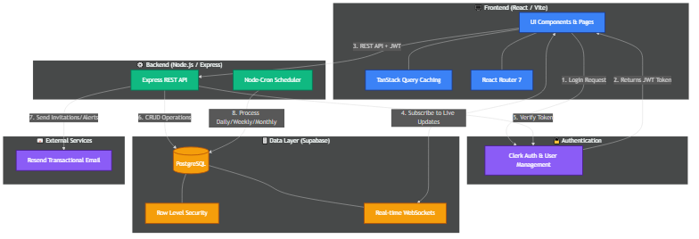
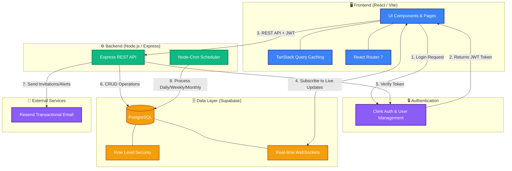

# System Architecture

This document provides a visual overview of the expense tracker application's architecture, showing how different components interact with each other.

## Interactive Diagram

## Architecture Overview

### Frontend Layer
- **React + Vite**: Modern build tooling and component-based UI
- **TanStack Query**: Server state management and caching
- **React Router 7**: Client-side routing

### Authentication
- **Clerk**: Handles user authentication, session management, and JWT token generation

### Backend Layer
- **Express REST API**: Handles business logic and data operations
- **Node-Cron**: Scheduled tasks for recurring operations (daily/weekly/monthly processing)

### Data Layer
- **Supabase PostgreSQL**: Primary database
- **Row Level Security (RLS)**: Database-level access control
- **Real-time WebSockets**: Live updates for collaborative features

### External Services
- **Resend**: Transactional email delivery for invitations and alerts

## Data Flow

1. User initiates login through the UI
2. Clerk authenticates and returns a JWT token
3. UI makes API requests with the JWT token
4. UI subscribes to real-time updates via WebSockets
5. API verifies tokens with Clerk
6. API performs CRUD operations on PostgreSQL
7. API sends emails via Resend for notifications
8. Cron jobs process scheduled tasks directly against the database
