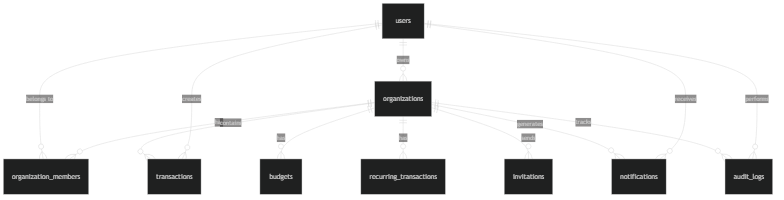
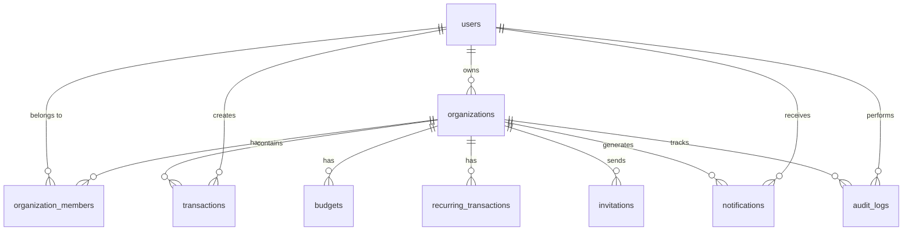

# Database Schema

This document describes the Supabase PostgreSQL database schema for the expense tracker application.

## Tables Overview

The database consists of 9 tables with Row Level Security (RLS) policies enabled:

### 1. `users`
Stores user profile information synced from Clerk.

```sql
CREATE TABLE users (
  id UUID PRIMARY KEY DEFAULT uuid_generate_v4(),
  clerk_user_id TEXT UNIQUE NOT NULL,
  email TEXT NOT NULL,
  full_name TEXT,
  avatar_url TEXT,
  created_at TIMESTAMPTZ DEFAULT NOW(),
  updated_at TIMESTAMPTZ DEFAULT NOW()
);
```

**RLS Policy**: Users can only read/update their own profile.

### 2. `organizations`
Stores organization/team information.

```sql
CREATE TABLE organizations (
  id UUID PRIMARY KEY DEFAULT uuid_generate_v4(),
  name TEXT NOT NULL,
  slug TEXT UNIQUE NOT NULL,
  owner_id UUID REFERENCES users(id) ON DELETE CASCADE,
  created_at TIMESTAMPTZ DEFAULT NOW(),
  updated_at TIMESTAMPTZ DEFAULT NOW()
);
```

**RLS Policy**: Members can read their organization; only owners can update.

### 3. `organization_members`
Junction table for organization membership.

```sql
CREATE TABLE organization_members (
  id UUID PRIMARY KEY DEFAULT uuid_generate_v4(),
  organization_id UUID REFERENCES organizations(id) ON DELETE CASCADE,
  user_id UUID REFERENCES users(id) ON DELETE CASCADE,
  role TEXT NOT NULL CHECK (role IN ('owner', 'admin', 'member')),
  joined_at TIMESTAMPTZ DEFAULT NOW(),
  UNIQUE(organization_id, user_id)
);
```

**RLS Policy**: Members can read their own memberships; admins/owners can manage memberships.

### 4. `transactions`
Core table for income and expense transactions.

```sql
CREATE TABLE transactions (
  id UUID PRIMARY KEY DEFAULT uuid_generate_v4(),
  organization_id UUID REFERENCES organizations(id) ON DELETE CASCADE,
  user_id UUID REFERENCES users(id) ON DELETE SET NULL,
  type TEXT NOT NULL CHECK (type IN ('income', 'expense')),
  category TEXT NOT NULL,
  amount DECIMAL(12, 2) NOT NULL,
  currency TEXT NOT NULL DEFAULT 'USD',
  description TEXT,
  transaction_date DATE NOT NULL,
  created_at TIMESTAMPTZ DEFAULT NOW(),
  updated_at TIMESTAMPTZ DEFAULT NOW()
);
```

**RLS Policy**: Organization members can read/create/update/delete transactions for their organization.

**Indexes**:
- `idx_transactions_org_date` on `(organization_id, transaction_date DESC)`
- `idx_transactions_user` on `(user_id)`
- `idx_transactions_type` on `(type)`

### 5. `budgets`
Monthly budget limits by category.

```sql
CREATE TABLE budgets (
  id UUID PRIMARY KEY DEFAULT uuid_generate_v4(),
  organization_id UUID REFERENCES organizations(id) ON DELETE CASCADE,
  category TEXT NOT NULL,
  amount DECIMAL(12, 2) NOT NULL,
  currency TEXT NOT NULL DEFAULT 'USD',
  month DATE NOT NULL, -- First day of the month
  created_at TIMESTAMPTZ DEFAULT NOW(),
  updated_at TIMESTAMPTZ DEFAULT NOW(),
  UNIQUE(organization_id, category, month)
);
```

**RLS Policy**: Organization members can read budgets; admins/owners can manage budgets.

### 6. `recurring_transactions`
Templates for recurring income/expenses.

```sql
CREATE TABLE recurring_transactions (
  id UUID PRIMARY KEY DEFAULT uuid_generate_v4(),
  organization_id UUID REFERENCES organizations(id) ON DELETE CASCADE,
  type TEXT NOT NULL CHECK (type IN ('income', 'expense')),
  category TEXT NOT NULL,
  amount DECIMAL(12, 2) NOT NULL,
  currency TEXT NOT NULL DEFAULT 'USD',
  description TEXT,
  frequency TEXT NOT NULL CHECK (frequency IN ('daily', 'weekly', 'monthly', 'yearly')),
  start_date DATE NOT NULL,
  end_date DATE,
  last_processed_date DATE,
  is_active BOOLEAN DEFAULT TRUE,
  created_at TIMESTAMPTZ DEFAULT NOW(),
  updated_at TIMESTAMPTZ DEFAULT NOW()
);
```

**RLS Policy**: Organization members can read; admins/owners can manage recurring transactions.

### 7. `invitations`
Pending organization invitations.

```sql
CREATE TABLE invitations (
  id UUID PRIMARY KEY DEFAULT uuid_generate_v4(),
  organization_id UUID REFERENCES organizations(id) ON DELETE CASCADE,
  email TEXT NOT NULL,
  role TEXT NOT NULL CHECK (role IN ('admin', 'member')),
  invited_by UUID REFERENCES users(id) ON DELETE SET NULL,
  token TEXT UNIQUE NOT NULL,
  expires_at TIMESTAMPTZ NOT NULL,
  accepted_at TIMESTAMPTZ,
  created_at TIMESTAMPTZ DEFAULT NOW()
);
```

**RLS Policy**: Organization admins/owners can create/read invitations; invited users can accept.

### 8. `notifications`
User notifications for budget alerts, invitations, etc.

```sql
CREATE TABLE notifications (
  id UUID PRIMARY KEY DEFAULT uuid_generate_v4(),
  user_id UUID REFERENCES users(id) ON DELETE CASCADE,
  organization_id UUID REFERENCES organizations(id) ON DELETE CASCADE,
  type TEXT NOT NULL CHECK (type IN ('budget_alert', 'invitation', 'transaction_alert')),
  title TEXT NOT NULL,
  message TEXT NOT NULL,
  is_read BOOLEAN DEFAULT FALSE,
  created_at TIMESTAMPTZ DEFAULT NOW()
);
```

**RLS Policy**: Users can only read/update their own notifications.

**Index**: `idx_notifications_user_unread` on `(user_id, is_read, created_at DESC)`

### 9. `audit_logs`
Audit trail for important actions.

```sql
CREATE TABLE audit_logs (
  id UUID PRIMARY KEY DEFAULT uuid_generate_v4(),
  organization_id UUID REFERENCES organizations(id) ON DELETE CASCADE,
  user_id UUID REFERENCES users(id) ON DELETE SET NULL,
  action TEXT NOT NULL,
  resource_type TEXT NOT NULL,
  resource_id UUID,
  metadata JSONB,
  created_at TIMESTAMPTZ DEFAULT NOW()
);
```

**RLS Policy**: Organization admins/owners can read audit logs.

**Index**: `idx_audit_logs_org_date` on `(organization_id, created_at DESC)`

## Relationships



### Interactive Diagram



## Migration Strategy

When moving from localStorage to Supabase:

1. **Data Migration**: Export localStorage data and import via API
2. **User Sync**: Clerk webhook syncs user data to `users` table
3. **Organization Setup**: Create default organization for each user
4. **Transaction Import**: Bulk insert transactions with proper foreign keys
5. **Enable RLS**: Ensure all policies are active before going live

## Backup & Recovery

- **Automated Backups**: Supabase provides daily backups (retained for 7 days on free tier)
- **Point-in-Time Recovery**: Available on paid plans
- **Export**: Use `pg_dump` for manual backups
